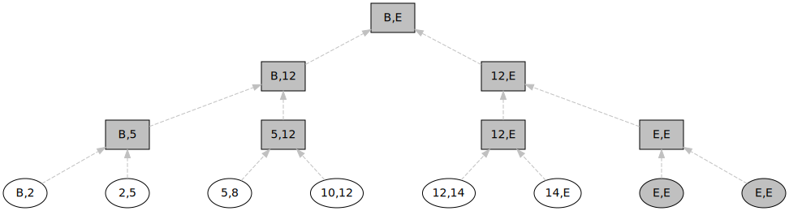

- Feature Name: Non-Revocation Range Tree
- Start Date: May 29, 2020
- RFC PR: (leave this empty)
- Ursa Issue: (leave this empty)
- Version: 1

# Summary

[summary]: #summary

A design for representing and processing revocation registry data in order to
optimize processing by issuers, provers, and verifiers, and support
zero-knowledge proofs of non-revocation.

# Motivation

[motivation]: #motivation

Credential revocation imparts processing requirements on all parties involved
in the issuing, presentation, and validation of a credential. It is important to
keep processing costs as low as possible while maintaining strong security
guarantees and avoiding exposure of additional correlating data on the behalf
of the credential holder.

An ideal revocation system is optimized for:

- low cumulative bandwidth
- low CPU and memory usage
- supporting zero-knowledge proofs of non-revocation
- ease of use and understanding (inspectable and auditable)
- compatibility with JSON-LD, BBS+ signed credentials

# Guide-level explanation

[guide-level-explanation]: #guide-level-explanation

Explain the proposal as if it was already included in Ursa and you were
teaching it to another Ursa programmer. That generally means:

- Introducing new named concepts.
- Explaining the feature largely in terms of examples.
- Explaining how Ursa programmers should _think_ about the feature, and how
  it should impact the way they use Ursa. It should explain the impact as
  concretely as possible.
- If applicable, provide sample error messages, deprecation warnings, or
  migration guidance.
- If applicable, describe the differences between teaching this to existing
  Ursa programmers and new Ursa programmers.
- If applicable, describe any changes that may affect the security of
  communications or administration.

# Reference-level explanation

[reference-level-explanation]: #reference-level-explanation

Assumptions:

- An issuer creates a revocation registry able to represent `n` credential revocations. The registry is published as a sequence of bits with zero indicating non-revoked entries and one indicating revoked entries. Each entry in the registry may eventually correspond to an issued credential, but only the currently-revoked indices are essential to publish
- The registry is available to the prover and verifier (in a streaming-capable compressed format), and it can be shown that the prover was issued a credential from the registry with a corresponding index. The prover prefers to hide this index to avoid correlation

Given the bits of the revocation registry, an involved party can construct a binary tree representing the non-revoked ranges of indexes. This representation is more compact than a binary tree containing every index of the tree along with its revocation state, while still allowing membership proofs for non-revoked credentials.

Each leaf in the tree represents an exclusive range `r` of non-revoked registry indexes `(a,b)`, such that each registry index `i`, `a < i < b` has not been revoked. The special values `B` and `E` represent the beginning and the end of the range – in practice the credential registry indexes `0` and `n-1` are likely to be reserved for this purpose, and would not be issued.

A tree with no revocations is represented simply as a root (leaf) node covering the entire range:

A fully revoked tree is only slightly more complex:

Let's examine a semi-pathological case for a registry of size 16 with a random revocation pattern, represented by the following list of revocation flags:

    [0, 1, 0, 0, 1, 0, 0, 1, 1, 1, 0, 1, 0, 1, 0, 0]

The revoked indexes are `(2, 5, 8, 9, 10, 12, 14)` and the non-revoked ranges are `(B,2) (2,5) (5,8) (10,12) (12,14) (14,E)`. Note that in this case where almost every other credential is revoked, only 6 leaf nodes are required for a registry with 16 entries.

The tree is left-balanced such that the height is approximately `ceil(log_2(r))+1` and there are no gaps between leaf nodes. In order to guarantee that each leaf in the tree is the same distance from the root (to avoid exposing the credential index along through the length of the hash chain), the tree is completed with empty range nodes up to the next power of 2. In this example two empty range leaf nodes are added, represented by `(E,E)`, as well as two additional branch nodes. No valid proof of inclusion can be generated based on an empty range node.

The maximum number of leaf nodes is `n/2` for an issuer who revokes every other index in the registry (creating no consecutive ranges), but in normal practice the number is much lower. The number of ranges is greatly reduced when the registry is not full, the proportion of revocations is either high or low, or the revocations are clustered in consecutive ranges. For example, the first million credentials of a registry may be revoked without creating any additional leaf nodes, only adjusting the bounds on the first leaf.

To prove that a paricular credential's index in the corresponding revocation registry is not currently revoked, it suffices for a prover to select `a,b` such that `a < index < b` and the range `a,b` is represented by a leaf in the tree. If the range is large enough, the prover could elect to simply reveal `a` and `b` along with the Merkle hash chain.

If the prover was assigned credential index `6` for example, it follows that `a,b = 5,8`. Bound proofs can be used to constrain the credential index between `a` and `b` without revealing the index, and without revealing `a,b`. A zero-knowledge proof of inclusion can be generated for the corresponding hash of `a||b` (and its hash chain), proving the non-revocation of the committed hidden value.

It is not necessary to construct the entire Merkle tree in memory in order to calculate the root hash of the tree or to generate an inclusion proof. Because the leaf nodes are naturally sorted and the tree is not sparse, a streaming algorithm can perform this operation using a stack of intermediate hash values approximately `log_2(r)` in size. It is not necessary to know the exact size of the tree before starting processing but in practice registry indexes will likely be represented by an unsigned 32-bit integer. A [proof of concept of this algorithm](https://github.com/andrewwhitehead/brangetree) is available.

# Drawbacks

[drawbacks]: #drawbacks

Why should we _not_ do this?

# Rationale and alternatives

[alternatives]: #alternatives

- Why is this design the best in the space of possible designs?
- What other designs have been considered and what is the rationale for not
  choosing them?
- What is the impact of not doing this?
- For incorporating new protocol implementations what other implementations
  exist and why were they not selected?
- For new protocols, what related protocols exist and why do the not satisfy
  requirements?

# Prior art

[prior-art]: #prior-art

The current revocation registry design maps each credential to a curve point
using the tails file. These files are relatively large (linear in the number
of credentials) and the time to generate a witness scales linearly as well.
The size of the related ledger transactions increases rapidly as credentials
are revoked.

> (link to existing design for bits-based registry without ZKP)

The concept of hashing the surrounding nodes to prove inclusion is partly inspired by [Strong Accumulators from Collision-Resistant Hashing](https://users.dcc.uchile.cl/~pcamacho/papers/strongacc08.pdf)

# Unresolved questions

[unresolved]: #unresolved-questions

- What parts of the design do you expect to resolve through the RFC process
  before this gets merged?
- What parts of the design do you expect to resolve through the implementation
  of this feature before stabilization?
- What related issues do you consider out of scope for this RFC that could be
  addressed in the future independently of the solution that comes out of this
  RFC?

# Changelog

[changelog]: #changelog

- [2020-05-29] - initial porting to RFC
